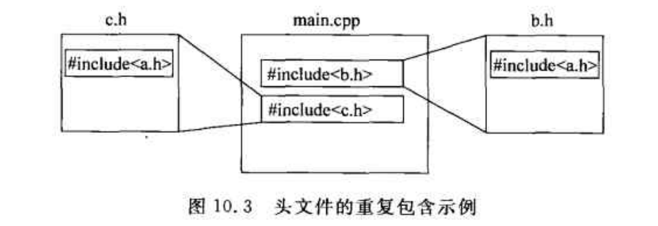

# C++随笔

# 第一篇

1. ### 右移运算符

如果符号位为1，则右移时补充1，反之则补充0。

2. ### sizeof

作用：求某一个变量或某一种数据类型的变量占用内存的字节数：

用法1:

sizeof(变量名)

用法2:

sizeof(类型名)

### 3. 引用（相当于C指针）用于函数之间参数的传递

==定义：引用就是某个目标变量的“别名”（alias）==

前面加const,即为“常引用”

不能通过常引用修改其引用的内容，必须用源变量去修改

> const T或const T & 类型的引用不能用来初始化T&类型的引用，除非进行强制类型转换；反向可以

引用作为函数的返回值

```c++
int n=4;
int & SetValue()
{
    return n;			//返回对n的引用
}
int main()
{
    SetValue() = 40;      //返回值是引用的函数调用表达式，可以作为左值使用
    cout << n << endl;    //40
    int &r = SetValue()
    cout << r << endl;     //40
   	return 0;
}
```


1. ### 常量指针

 不可通过常量指针修改其指向的内容（1）和其引用的变量（2）

```c++
int n,m;
const int * p =&n;
*p = 5;  //编译出错（1）
p = 5; //编译出错（2）
n = 4;   //ok
p= &m;  //ok,常量指针的指向可以变化
```

> 和上述的引用类似，不能把常量指针赋值给非常量指针，除非进行强制转换；反过来可以

`函数参数为常量指针时，可避免函数内部不小心改变参数指针所指向地点的内容`

不能修改行为本身，但可以改变其目标

5. ### 动态内存分配(用new)

用法1:分配一个变量

P = new 类型名;

P是类型为T*的指针

动态分配出sizeof(T)大小字节的内存空间，并且将该内存空间的起始地址赋给P

用法2:分配一个数组

P = new T[N];

T：任意类型名

P：类型为T*的指针

N：要分配的数组元素的个数，可以是整形表达式

动态分配出sizeof(T)*N大小字节的内存空间，并且将该内存空间的起始地址赋给P

6. 动态内存释放(用delete)

```c++
delete 指针;    //该指针必须指向new出来的空间

int *p = new int;
* p =5;
delete p;
delete p;    //异常，一片空间不能被delete多次
```

7. freopen 方便调用程序

```c++
//每次运行程序输入的数据多时，减少麻烦
#include <iostream>
using namespace std;
int main()
{
    freopen("c:\\adsf\\safds\\test.txt","r",stdin);
    int n;
    cin >> n;
    while(n --)
    {
        int a,b;
        cin>>a>>b;
        cout << (a>b?a:b) <<endl;
    }
}
```

8. 内联函数(内联函数应该只是很简单的，执行很快的几条语句，否则得不偿失)

说明：因为在调用普通函数时，需要重新给形参和局部变量开辟空间，将实参的值复制给形参，还需要将函数的返回地址放入栈中，耗费时间多。用内联函数可以直接将整个函数体的代码插入地调用语句处。

> 但很显然，使用内联函数比使用普通函数会使最终可执行程序的体积增加，以时间换取空间或增加空间消耗来节省空间，这本是计算机学科中常用的方法。
>
> **且内联函数必须在使用之前定义完成，不能只出现内联函数的声明。

9. 函数的重载

C++允许多个函数取相同的名字，只要参数表不同即可，这称为函数的重载(overload)。

10. ## string 字符串类型（优先考虑）

为了防止数组越界而用的一个类。

体积是固定的，在不同编译器上不相同，并不会直接存放字符串，字符串会在别处开辟内存空间存放，string对象只存放该内存空间的地址或其他一些信息。（类似指针）

1.1 string对象之可以用比较运算符进行比较，也可以用算法运算符进行相加，相当于连接。

比较大小时，是按词典顺序比较，而且大小写相关。（ASCII码）

10. ### 数组作为函数的参数

不用写出数组的元素个数，数组作为函数参数时，是传引用的，即形参是实参的引用。

**二维数组作为参数时，必须要写明数组有多少列。

==srand用来设置种子，rand用来生成随机数==

12. 数组越界后果严重（编译器之间有差异）
13. strcmp(str1,str2).   用于比较小两个字符串，相同则返回0，str1<str2，返回负数，str1>str2,返回正数。
14. strlen用于求字符串长度。
15. strcat(str1,str2). 把str2接到str1后面
16. strupr(s1);  变成大写
17. strcpy的参数是是按位替换。
18. cin.getline(char buf[],int bufSize); 

功能：将用户从键盘输入的一整行，当作一个字符串读如到内存缓冲区buf中，并在末尾自动添加'\0'，但只会读入bufSize - 1个字符。

19. **char \*strncpy(char \*dest, const char \*src, size_t n)** 把 **src** 所指向的字符串复制到 **dest**，最多复制 **n** 个字符。当 src 的长度小于 n 时，dest 的剩余部分将用空字节填充。


# 2. 指针

T *p

指针的作用：给予了我们自由访问内存空间的手段，通过指针程序能够访问的内存区域不再局限于变量锁占据的数据区域了，存放程序指令的指令去，别的程序的数据区，指令区，甚至操作系统的数据区和指令区都可以被程序访问和修改。

  变量P就是一个指针变量，P的类型是T*，表达式“*P”的类型是T，而通过表达式“*P”，就可以读写从地址P开始的sizeof(T)个字节。（即"\*p"等价于存放在p处的一个T类型的变量。

2.1指针运算

（1）两个同类型的指针可以比较大小。

（2）两个同类型的指针可以相减相加。

p2 - p1 = (地址2 - 地址1)/sizeof(T)

p1 + n = 地址p1 + n*sizeof(T) 

（3）指针变量可以加减一个证书类型变量或常量。

（4）可自增自减。

（5）p[n] = "*(p+n)"

2.2 空指针

在C++语言中，可以用”NULL“关键字对任何类型的指针进行赋值。值为NULL的指针，被称作空指针。空指针指向地址0。

2.3 指针作为函数参数

```c++
//(1)
void swap(int * p1,int * p2){}
int main()
{
    int m=3,n=4;
    swap(&m,&n);            //此时p1指向了m,p2指向了n，所以通过调用函数和一改变实参，但仍然是传值的方式
}

//(2)
void swap(int * p1,int * p2){}
int main()
{
    int m=3,n=4;
    int *pm = &m;
    int *pn = &n;
    swap(&pm,&pn);         //此时p1,p2和pm,pn没有联系，前者只是后者的拷贝,故不会改变实参和指向的变量
}
    
```

2.4 常量指针

Const T *p;

区别在于不能通过常量指针区修改其指向的内容。

2.5 字符串和指针

字符串常量和字符数组名的类型都是 char *,因此可以用它们给char *赋值。

2.6 string对象和char *指针的关系

可以用 char *类型的指针对string进行赋值。

string对象有一下成员函数：

const char *c_str();

该成员返回指向string对象中的字符串的指针，也是以"\0"结尾，返回的指针是const的，所以不能通过该指针去修改string对象中的

字符串的内容。

```c++
const char *p = s.c_str();
//如果s的内容发生了改变，则p指针很可能不再有效，因为s内容的改变意味着存放s中字符串的内存空间的地址可能已经变了。
```

2.7 void指针

可以用任何类型的指针对void指针进行赋值或初始化。但是由于sizeof(void)没有定义，所以对于 void *类型的指针p,表达式"\*p"也没有定义，不能进行指针运算。

主要用于内存复制，将内存中某一块的内容复制到另一块中，那么源块和目的块的地址就都可以用void指针表示。

在cstring头文件中的库函数：

void * memset(void *dest,int ch,int n);

```c++
int a[100];
memset(a,0,sizeof(a));
//数组a的每个元素都变成0
```


将从dest开始的n个字节，都设置成ch,返回值是dest,ch虽然是整形，但只有最低字节是起作用的。

void *memcpy(void *dest,void *src,int n);

将地址src开始的n个字节，复制到地址dest，返回值是dest。

```c++
int a1[10];
int a2[10];
memcpy(a2,a1,10 * sizeof(int));
//将数组a1的内容复制到数组a2中去
```

2.8 函数指针

定义：每个函数都会占用一段连续的内存空间，函数名则代表起始位置（“入口地址”），可以将函数体的入口地址赋给一个指针变量，是该指针变量指向该函数，然后通过指针变量就可以调用这个函数。

一般形式：

类型名 （* 指针变量名)(参数类型1,....);

可以用一个原形匹配的函数的名字给一个函数指针赋值。

```c++
coid PrintMin(int a,int b)
{
    if(a<b)
        cout << a;
    else
        cout << b;
}
int main()
{
    void (* pt)(int,int);
    int x=4,y=5;
    pf = PrintMin();
    pf(x,y);
    return 0;
}
```

应用：

C++中有一个快速排序的标准库函数qsort,在cstdlib中声明

void sort(void * base,int nelem,unsigned width,int(*pfCompare)(const void *,const void *));

该函数可以对任何类型的一维数组排序。

base:待排序数组的每个元素的大小（字节）

pfCompare:函数指针，指向一个“比较函数”

过程：排序就是一个不断比较元素，并交换元素位置的过程。qsort在执行期间，会以这两个元素的地址作为参数，通过pfCompare指针调用一个“比较函数”，根据“比较函数”的返回值来判断两个元素哪个更应该排在前面。

qsort函数的用法规定，“比较函数”的原型应是：

int 函数名(const void *elem1,const void *elem2);

该函数必须具有一下行为：

(1) 如果 \*elem1应该排在\*elem2前面，则函数返回值是负整数（任何都🉑️）。

(2)如果\*elem1和\*elem2哪个排在前面都行，那么函数返回0。

(3)如果\*elem1应该排在\*elem2后面，则函数返回值是正整数（任何都🉑️）。


# 3.自定义数据类型(struct)

## 3.1 结构:

3.1.1 struct struct_name{ }(可以在这直接定义变量);				

> struct_name可以作为数据类型名使用，即定义了一个新的数据类型

由结构类型定义的变量，统称为“结构变量”，结构的成员变量，称为结构的“域(field)“。

3.1.2 两个同类型的结构变量，可以相互赋值。

3.1.3 一个结构的成员变量可以是任何类型的，包括可以是另一个结构类型。

## 3.2 结构变量的成员变量

3.2.1 访问：结构变量名.成员变量名

3.2.2 初始化

可以在定义时进行初始化：

2Student stu = { , , , , ...}

3.2.3 **结构数组

方式： 结构名 数组名[num];

定义了一个num个元素的结构数组

若没有被定义到，其存储空间中的每个字节都被写入二进制数0。

3.2.4 指向结构变量的指针“结构指针”

定义形式： 结构名 *指针变量名;

Student *pStudent;

Student Stu1;

pStudent = &Stu1;

Student Stu2 = * pStudent;

通过指针，访问其指向的结构变量的成员变量的方法：

(1) 指针->成员变量名					pStudent -> ID;

(2) (* 指针).成员变量名				(* pStudent).ID;

指针变量可以指向一个结构数组，这是结构指针的值是整个结构数组的==起始地址==。

# qsort????

4. ## 动态分配结构变量和结构数组

结构变量，结构数组都可以动态分配存储空间

```c++
Student *pStu = new StudentEx;		//定义结构指针pStu,动态定义变量
pStu -> ID = 1234;
delete pStu;						//清除pStu的指向（？？？）
pStu = new StudentEx[20];			//动态定义一组变量
pStu[0].ID = 1235;
delete [] pStu;						//动态删除，实现动态分配存储空间
```

5. ## 结构变量或引用作为函数形参

在正常传值的情况下，形参是实参的复制，

```C++
void 函数名(Student Stu){......};
Student Stu1;
函数名(Stu1);
```

如果结构体的体积较大，那么这个复制操作就会消耗不少的空间和时间，不妨考虑使用“引用”作为函数参数，这时参数传递的只是4个字节的地址，从而减少了时间和空间的开销。

```c++
void 函数名(const Student &Stu){......};
//const确保函数中不会出现修改stu值的语句，以及告诉阅读或修改此程序的程序员，该函数中不该修改stu的值
Student Stu1;
函数名(Stu1);
```

6. ## 联合

结构：

union 联合名{

​	类型名 成员变量名 1；

​	类型名 成员变量名 2；

​	...

};

联合类似于结构体，区别在于，所有的成员变量都是从相同的地址（即联合变量的地址）开始存放的，成员变量的存储空间有重叠，整个联合变量的体积等于体积最大的那个成员变量的体积。


重点：

​	C++的int, unsigned int, short,long等等类型的变量，在内存中存放的形式都是高位存放在地址大的的地方。

例如，对于 int n = 0x61626364;

n在内存中存放时，地址从小到大的4个字节，存放的内容依次是:0x64,0x63,0x62,0x61(如图8.2中u.a的存放方式一样)

​	该类特点说明C++是比较接近硬件底层的语言，甚至可以内嵌汇编语言，此时联合就比较有用。

​	当做算术运算等各种运算时，都需要先将变量从内存复制到寄存器，然后才能计算，计算后再从寄存器复制到内存。便携汇编语言时，可以访问全部内容，也可以指访问寄存器的高16位或低16位，就可以使用联合来完成此任务：

```c++
//用联合模拟寄存器
union Register
{
    unsigned int word;				//word表示32位
    struct{
        unsigned short L;			//寄存器低16位
        unsigned short H;			//寄存器高16位
    }data;
}
//这两个成员变量体积相同，完全重叠，可单独修改低16位或高16位
int main()
{
    Register AX;
    AX.word = 0x12345678;
    AX.data.H = 0x9999;
}
```

7. ## 枚举类型

定义方式：

enum 枚举类型名 {枚举值 1,枚举值 2,...,枚举值 n};

枚举类型名 变量名;

“枚举值”和枚举类型变量可以被自动转换成整形值(从0开始)，但整形值不能自动转换成枚举值。

例：

```c++
Weekday workingDay = SUN;
cout << MON << "," << WED << "," <<workingDay;
>> 0,2,6
workingDay = 3;				//编译出错
```

在定义枚举类型时，可以指定枚举值所对应的整形数值。

```c++
enum CarColor{red = 7,white,black,blie = 6,green,yellow};
//则各个枚举值对应的数值是：
//red:7,while:8,black:9,blue:6,green:7,yellow:8
```

## 8. 用typedef定义类型

使用typedef关键字，可以给类型的名字起别名，此后别名就和类型名代表同一种类型了，具体用法：

typedef 类型名 类型别名;

w!(不懂)[

9. "::"作用域符 双冒号

::是作用域，运算符中等级最高，它分为3种：

1. global scope(全局作用域符),用法(::name)
2. class scope(类作用域符),用法(class:name)
3. namespace scope(命名空间作用域符),用法（namespace::name)

都是左关联，作用都是为了更明确的调用你想要的变量:

作用域符号::的前面一般是类名称，后面一般是该类的成员名称

```c++
char zhou; //全局变量
void leep()
{
    char zhou;  		//局部变量
    zhou(局部变量) = zhou(局部变量)*zhou(局部变量);
    ::zhou(全局变量) = ::zhou(全局变量)*::zhou(全局变量);
}
```


10. 一个程序所占用的内存区域

- 代码区：存放指令的，函数都存放在代码区
- 全局数据区：全局变量存放于全局数据区
- 栈区：局部变量存放于栈区
- 堆：动态内存分配则是从堆区的内存空间。

11. # 静态变量，动态变量和寄存器变量

静态变量：存放这些变量的内存地址，在整个程序运行期间，都是固定不变的。如全局变量。

局部变量定义时前面加了“static”关键字。若没加，就是自动变量(函数的形参也是自动变量)，在程序运行期间，自动变量的存储地址并不固定。每次调用定义它的函数时，它的内存地址可能都不一样(但是在一次函数调用过程中不会变化)。

静态局部变量和自动局部变量的区别在于：

前者存放于全局数据区，他的存储空间不会被别的变量占用，因此其值在定义它的函数执行完后还能保持不变，即函数本次开始执行时，局部静态变量的值是上次执行完的值（若是第一次执行，则是初始化值或全0;

而自动局部变量是在每次函数调用，执行到定义它的语句时才在栈上分配空间给它，即每次执行函数时，自动局部变量的初始值全部reset。

```c++
//自动局部变量
for(int i=0;i<3;i++)
{
    int n=0;
    static int m = 0;
    n++;m++;
    cout << n << " " << m << endl;
}
>>1 1
>>1 2
>>1 3
```

寄存器变量：在定义局部，非静态变量时，在变量类型前面加register关键字，就将变量定义为"寄存器变量"。如：

​	register int i;

其作用是将该变量间被留在寄存器中，以减少在寄存器和内存中来回复制该变量的次数，来加快执行速度。

> 但现在极少有需要靠寄存器变量来显著提高速度的时候，而且编译器会有优化手段,自动将特别频繁使用的变量放到寄存器中。

11. 文件包含

在头文件中，一般包含以下内容：

- 函数的定义。例如，枚举类型，结构，联合，还有“类”的定义等等
- 函数的声明
- 内联函数的函数体
- 用#define命令定义的函数常量或宏
- 用const声明的常变量。同名常伴量出现在多个.cpp文件中，不算重复定义
- 用extern声明的全局变量
- 模版。模版是后面要学的内容

\#include命令的两种形式

用“<>”的情况下，预编译器不会到当前文件夹中去找头文件，智慧去编译器制定的文件夹中去找；

用“ " " “的情况下，会先到当前文件夹去找头文件，然后再到编译器指定的文件夹去找头文件

12. ## 条件编译

形式1:

```c++
#ifdef 标识符					/如果“标识符”在前面有定义，即用#define命令定义过
	程序段1					//则编译程序段1
#else
    程序段2
#endif
```

形式2:

```c++
#ifndef 标识符					//和形式1相反，若没有被定义，则编译程序段1
		程序段1				//用于防止头文件重复引用
#else
        程序段2
#endif
```

13. 命令行参数

形式：

```c++
int main(int argc,char *argv[])
//argc代表命令行参数的个数，argv[]代表该指针指向一个字符串，这个字符串就是一个命令行参数
{
    ...
    return 0;
}
```

14. 多文件共享全局变量

写法：

extern 变量类型 变量名;

同一个全局变量，可以在多个文件中声明，但是只能在一个文件中定义。

在其他文件使用时，需要先声明变量，再使用。

> 用C++编程，尽量不要使用全局变量，可以用类的静态成员变量代替全局变量。

15. 静态全局变量和静态全局函数

  定义前面可以加“static”关键字。

好处在于只能用于当前定义的文件中，不会引起重复定义的错误，时避免命名冲突的一种手段。

不过C++有更好的机制来避免命名冲突，“名字空间”，静态方法只是处于兼容的考虑。

16. ## 用条件编译避免头文件的重复包含



这种情况下用条件编译可以放置头文件的重复包含。具体做法是每个头文件都以一条“#ifndef”与编译命令开头，以“#endif”结尾。例如，对于包含了某结构定义的头文件a.h,可以如下编写：

```c++
#ifndef A_H
#define A_H
struct Movie{
};
#endif
```

# 第二篇 面向对象的程序设计

面向对象的程序设计有“抽象“，”封装”，“继承”，“多态”4个基本的特点。

- 对象的特点包括两个方面：

1. 属性是指对象的静态特征，可以用变量来表示。
2. 方法是指对象的行为，以及能对对象进行操作，可以用函数来表示。

> 方法可以对属性进行操作。

- 抽象是指将同一类事物的共同特点概括出来的过程。
- 完成抽象后，将数据和用以操作数据的那些算法捆绑在一起，形成“类”，这个过程就称为“封装”。还可以将对象的一部分属性和方法隐藏起来，留下另一些属性和方法对外可见，作为对对象进行操作的接口。这样就能合理安排数据的可访问范围，减少程序不同部分之间的耦合度，从而提高代码扩充，代码修改，代码重用的效率。
- 所谓“继承”，就是在编写一个“类”的时候，可以用现有的类作为基础，是的新类从现有的类“派生“出来(类似于父类和子类的关系)，从而达到代码扩充和代码重用的作用。
- “多态”是指不同种类的对象都具有名称相同的行为，而具体行为的实现方式却有所不同。

1. ## 类的定义和使用

```c++
//“类”的定义方法
class 类名
{
    访问范围说明符；			//有"public","private","protected"三种,暂且都用”public“
        成员变量1；
        成员变量2；
        ...
    	成员函数声明1；
        成员函数声明2；
    访问敢为说明符：
        更多成员变量
        更多成员函数声明
        ...
};
```

成员变量就代表对象的“属性”，成员函数就代表对象的“方法”。

==一个类的成员函数之间可以互相调用，类的成员函数是可以重载的，也可以设定参数的默认值==

成员函数的实现可以在类的定义外面写，格式如下：

```c++
返回值类型 类名::函数名()
{
    语句组
}
```

用法和python基本相同，先用

类名 变量名;

做出类的实例对象

变量名.属性;

引用类的属性

### 1.1 访问对象的成员

可以用“指针->成员名”的方式来访问：

```c++
CRectangle r1,r2;
CRectangle *p1 = &r1;
CRectangle *p2 = &r2;
p1 ->w = 5;							//此处的w属于p1指向的对象
p2 ->Init(5,4);						//Init作用在p2指向的对象上
```

还可用“引用名.成员名”的办法来访问对象的成员：

```c++
CRectangle r2;
CRectangle &rr = r2;
rr.w = 5;
rr.Init(5,4);					//rr的值变了，r2的值也变了
```

