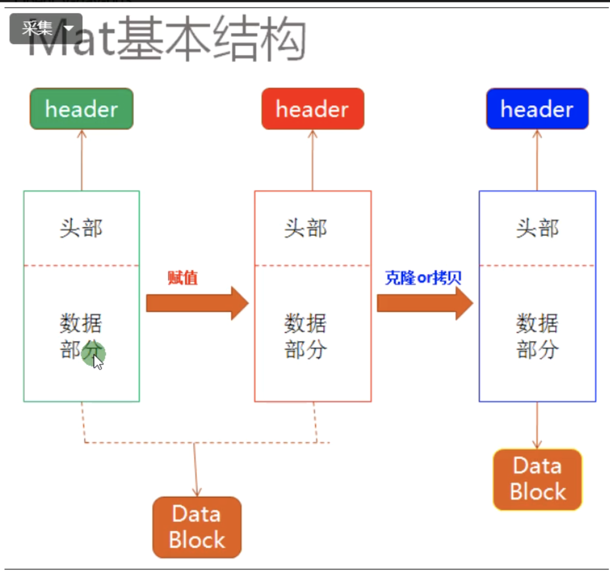

# OPENCV4

编译格式：

```
g++ `pkg-config opencv4 --cflags` 1.cpp  -o demo `pkg-config opencv4 --libs`
**若是有头文件应该连同头文件一起编译
```

# 1. 图像读取与显示

```c++
imread("图像的地址",参数2);				读取图像，返回值为Mat类型，参数2可以调整读取图片的形式（灰度，通道等等）

Imshow("名称",imread的返回值);			

waitKey(0);						0表示阻塞，1表示停止1ms，依此类推

destroyWindows();				销毁所有显示窗口

namedWindow("输入窗口",WINDOW_FREERATIO);		自由调整窗口大小
```

# 2. 图像色彩空间转换

```c++
void colorSpace_Demo(Mat &image){
	Mat gray,hsv;
	cvtColor(image,hsv,COLOR_BGR2HSV);		//图像色彩空间转换
    // H 0 ~ 180 S,V 0 ~ 255
    // H S(调整饱和度) 表示颜色 , V表示亮度
	cvtColor(image,gray,COLOR_BGR2GRAY);
	imshow("HSV",hsv);			//显示图像
	imshow("灰度"，gray);
	imwrite("路径",hsv);
	imwrite("路径",gray);			//存储图像
}
```

# 3. 图像对象的创建与赋值



头部：有Mat的基本信息（通道数等）

```c++
void mat_creation_demo(Mat &image)
{
    Mat m1,m2;
    m1 = image.clone();
    image.copyTo(m2);
    
    //创建空白图像
    Mat m3 = Mat::zeros(Size(8,8),CV_8UC1);
    //m3 = 127;  	只给第一个通道赋值
    //m3 = Scalar(127);  三个通道都赋值
    //Mat m3 = Mat::ones(Size(8,8),CV_8UC1);
    //Mat m3 = Mat::zeros(Size(8,8),CV_8UC3);
    //8字节，unsigned char 设置为3个通道
    std::cout << "width:" << m3.cols << "height:" << m3.rows << "channels:" << m3.channels() << std::endl;
    //clos表示宽度(列/通道数)，rows表示高度(行),channels()表示通道数
    std::cout<<m3<<std::endl;
    imshow("创建图像",m3);
}
```

# 4. 图像像素的读写操作

> 一切对象皆Mat

```c++
//像素指针操作 反写
for(int row = 0;row < r;row++){
            uchar* current_row = image.ptr<uchar>(row);
            for(int col = 0;col < w;col++){
                if(dims == 1){      //gray
                    int pv = *current_row;
                    *current_row++ = 255 - pv;
                }
                if(dims == 3){          //BGR
                    *current_row++ = 255 - *current_row;
                    *current_row++ = 255 - *current_row;
                    *current_row++ = 255 - *current_row;
                }
        }
//像素数组操作 反写
for(int row = 0;row < r;row++){
        for(int col = 0;col < w;col++){
            if(dims == 1){      //gray
                int pv = image.at<uchar>(row,col);
                image.at<uchar>(row,col) = 255 - pv;
            }
            if(dims == 3){          //BGR
                Vec3b bgr = image.at<Vec3b>(row,col);
                image.at<Vec3b>(row,col)[0] = 255 - bgr[0];
                image.at<Vec3b>(row,col)[1] = 255 - bgr[1];
                image.at<Vec3b>(row,col)[2] = 255 - bgr[2];
            }
        }
```

# 5. 图像像素的算术操作

```c++
Mat dst;
dst = image * Scalar(50,50,50);		//加减除都可以
//乘法操作
Mat m = Scalar(2,2,2);
multiply(image,m,dst);
imshow("乘法",dst);

//加法的本质操作
int w = image.cols;
    int h = inage.rows;
    int dims = image.channels();
    for(int row = 0;row < r;row++){
        for(int col = 0;col < w;col++){
            Vec3b p1 = image.at<Vec3b>(row,col);
            Vec3b p2 = m.at<Vec3b>(row,col);
            dst.at<Vec3b>(row,col)[0] = saturate_cast<uchar(>p1[0] - p2[0]);		//放置溢出
            dst.at<Vec3b>(row,col)[1] = saturate_cast<uchar(p1[1] - p2[1]);
            dst.at<Vec3b>(row,col)[2] = saturate_cast<uchar(p1[2] - p2[2]);
        }
        }
//加减乘除现成函数,dst为容器
add(image,m,dst);
substract(image,m,dst);
divide(image,m,dst);
multiply(image,m,dst);
```

# 6. 滚动条操作演示-调整图像亮度

TrackBar(滚动条操作)

**static void on_track(int, void*) 为固定格式**

# 7. 滚动条操作演示-参数传递度

```c++
void cv::addWeighted(cv::InputArray src1, double alpha, cv::InputArray src2, double beta, double gamma, cv::OutputArray dst, int dtype = -1)
公式：
dst = src1*alpha+src2*beta+gamma;
```

# 8. 键盘相应操作

```C++
waitKey(等待时间);
```

# 9. openCV自带颜色表操作s
