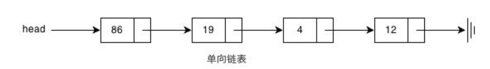
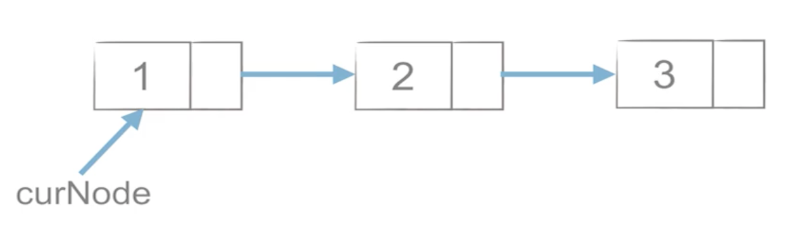
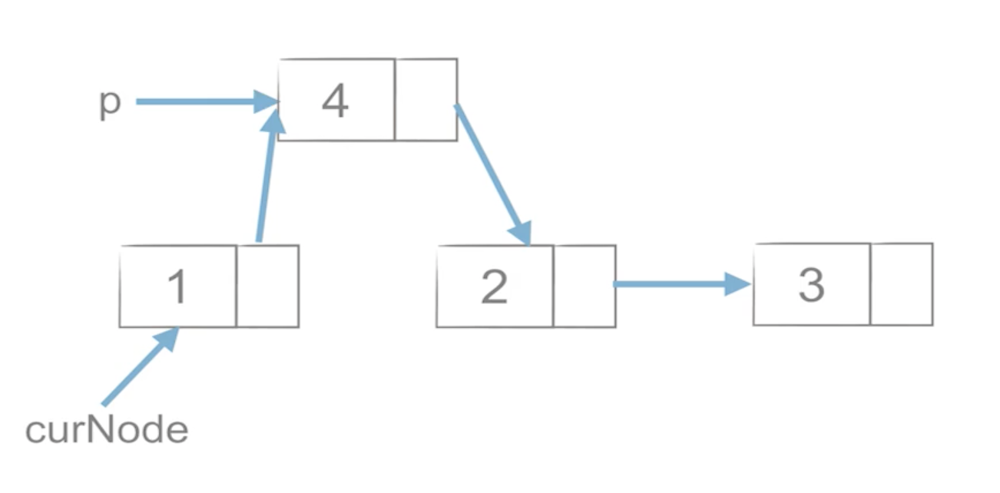
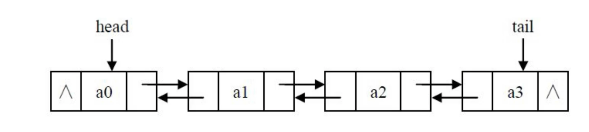
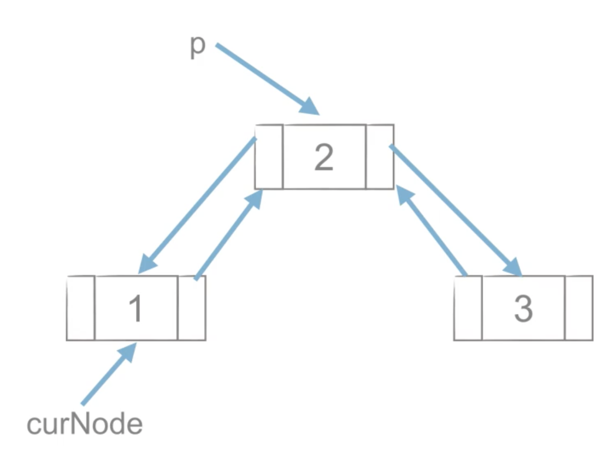
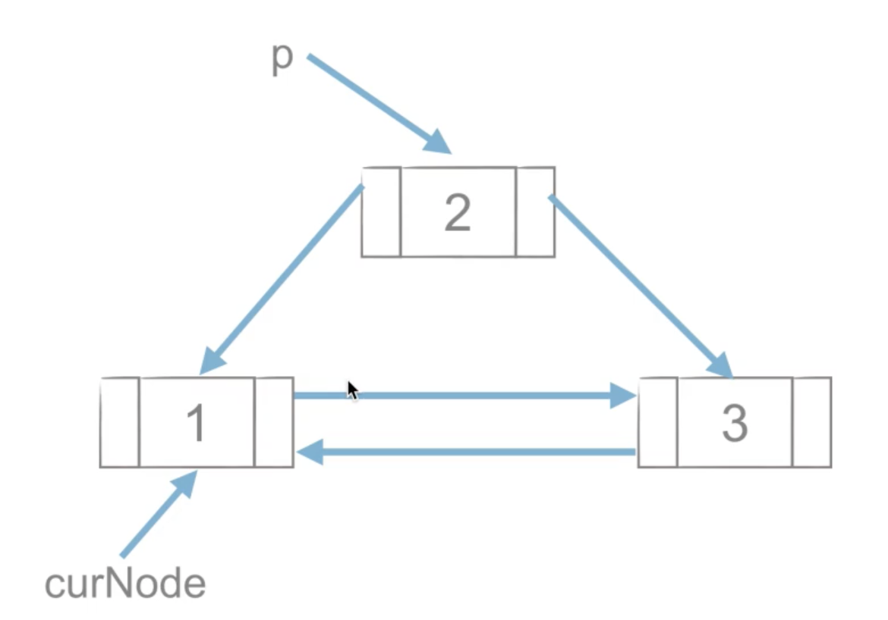
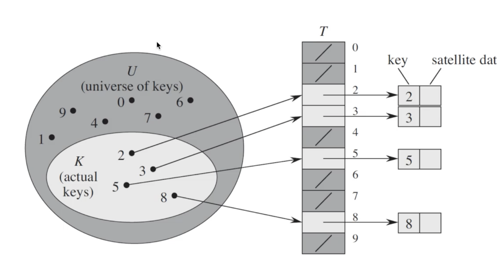
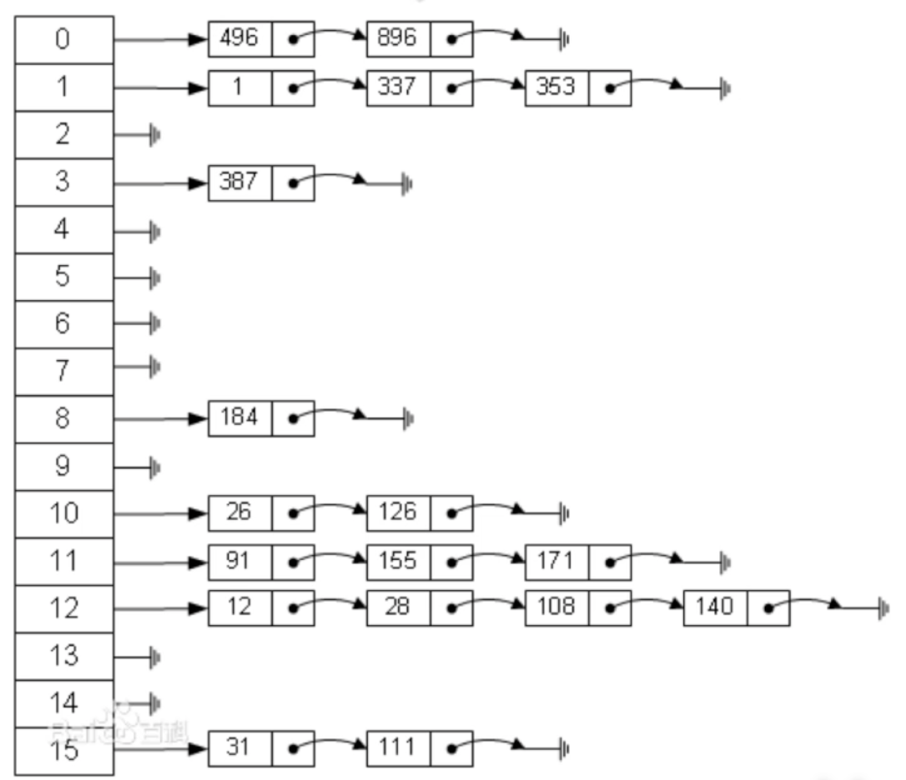

# 1. 列表

32位机器上，一个整数占4个字节，一个地址占四个字节

64位机器上，一个地址占八个字节（相当于地址变多了）

>  python的列表和C语言的数组由两点不同：
>
> ​		1.数组元素类型要相同
>
> ​		2.数组长度固定
>
> ​				两个不同点的原因相同：
>
> ​				在C语言直接在数组里表示了数据类型，而在Python中列表中存储的事数据类型的地址，所以不限元素类型和长度


# 2. 栈

概念：栈(stack)是一个数据集合，可以理解为只能在一端进行插入或删除操作的列表。

特点：后进先出LIFO(last-in,first-out)


# 3. 队列

概念：队列(Queue)是一个数据集合，仅允许在列表的一端进行插入，另一段进行删除。

特点：先进先出FIFO(first-in,first-out)

### 队列的实现方式：环形队列

环形队列：

- 当对尾指针front == Maxsize + 1时，在前进一个位置就自动到0
- 队首指针前进1:front = (front + 1) % Maxsize
- 队尾指针前进1:rear = (rear + 1) % MaxSize
- 队空条件:rear == front
- 队满条件:(rear + 1) % MaxSize == front


双向队列：

两端都可以进队或出队的队列(dequeue)


# 4. 链表

概念：链表是由一系列节点组成的元素集合。每个节点包含两部分，数据域item和指向下一个节点的指针next。通过节点之间的相互连接，最终串联成一个链表。



创建列表：

- 头插法
- 尾插法

### 单链表节点的插入

```python
p.next = curNode.next
curnode.next = p
```



### 单链表节点的删除

```python
p = curNode.next
curNode.next = curNode.next.next
del p
```



## 双链表

> 双链表的每个节点有两个指针：一个指向后一个节点，另一个指向前一个节点。

```python
class Node(object):
    def __init__(self,item):
        self.item = item
        self.next = None
        self.prior = None
```



### 双链表节点的插入

```python
p.next = curNode.next
curnode.next.prior = p
p.prior = curNode
curNode.next = p
```



### 双链表节点的删除

```python
curNode.next = curNode.next.next
curNode.next.prior = curNode
del p
```



#### 总结：

- 链表在插入和删除的操作上明显快于顺序表
- 链表的内存可以更灵活的分配
- 试利用链表重新实现栈和队列
- 链表这种链式存储的数据结构对树和图的结构有很大的启发性

# 5. 哈希表

概念：一个通过哈希函数来计算数据存储位置的数据结构

> 通常支持如下操作：
>
> ​		Insert,get,delete

直接寻址表：当关键字的全域U比较小时，直接寻址是一种简单而有效的方法



直接寻址技术缺点：

- 当域U很大时，需要消耗大量内存，很不实际
- 如果域U很大而实际出现的key很少，则大量空间被浪费
- 无法处理关键字不是数字的情况

哈希表 = 直接寻址表 + 哈希

### 哈希

直接寻址表：key为k的元素放到k位置上

改进直接寻址表：哈希(Hashing)

- 构建大小为m的寻址表T
- key为k的元素放到h(k)位置上
- h(k)是一个函数，其将域U映射到表T

## 哈希表

Hash Table(又称散列表):是一种线性表的存储结构。哈希表由一个直接寻址表和一个哈希函数组成。哈希函数h(k)将元素关键字k作为自变量，返回元素的存储下标。

### 哈希冲突

由于哈希表的大小是有限的，而要存储的值的总数量是无限的，因此对于任何哈希函数，都会出现两个不同元素映射到同一个位置上的情况，这种情况叫做哈希冲突。

> 解决哈希冲突的方案1:
>
> ​		拉链法：哈希表每个位置都连接一个链表，当冲突发生时，冲突的元素将被加到该位置链表的最后。



# 6. 树与二叉树

树是一种可以递归定义的数据结构（比如：目录结构）

数是由n个节点组成的集合：

- 如果n=0，那这是一棵空树
- 如果n>0，那存在1个节点作为树的根节点，其他节点可以分为m个集合，每个集合本身又是一棵树。

### 二叉树的遍历（重点）

1. 前序遍历
2. 中序遍历
3. 后序遍历
4. 层次遍历

### 二叉搜索树

二叉搜索树是一颗二叉树且满足性质：设x是二叉树的一个节点。如果y是x左子树的一个节点，那么y.key<=x.key;如果y是x右子树的一个节点，那么y.key>=x.key。

> 二叉搜索树的操作：查询、插入、删除