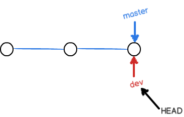

1. git init 命令把这个目录变成git仓库

2. git add 文件名 文件修改后加入到暂存区

3. git commit m- "注释" 

4. git status 随时查看仓库当前的状况

5. git diff 文件名 尚未提交但是已经修改过的在暂存区的内容

6. git log 历史记录 "出现commit时的注释".   git log --pretty=oneline

    git log --graph --pretty=oneline --abbrev-commit

7. 回退上一个版本

git reset --hard HEAD (当前版本是HEAD,上一个版本是HEAD^,以此类推，版本过久，可以用HEAD~n表示)

7. git reflog 用来记录每一次命令(可应用于恢复到最新的版本，需要知道commit id)

8. 

    

    第一步是用`git add`把文件添加进去，实际上就是把文件修改添加到暂存区；

    第二步是用`git commit`提交更改，实际上就是把暂存区的所有内容提交到当前分支。

    因为创建Git版本库时，Git自动为我们创建了唯一一个`master`分支，所以，现在，`git commit`就是往`master`分支上提交更改。

    9. 命令`git checkout/restore -- readme.txt`意思就是，把`readme.txt`文件在工作区的修改全部撤销，这里有两种情况：

        一种是`readme.txt`自修改后还没有被放到暂存区，现在，撤销修改就回到和版本库一模一样的状态；

        一种是`readme.txt`已经添加到暂存区后，又作了修改，现在，撤销修改就回到添加到暂存区后的状态。

        总之，就是让这个文件回到最近一次`git commit`或`git add`时的状态。

    10. git reset HEAD <file>  可以把缓存区的修改撤销掉，重新放回工作区

    11. git rm 从版本库中删除文件，但是可用git checkout -- 文件名 

    12. 要关联一个远程库（github),使用命令 git remote add <origin> git@server-name(github.com):githubname/reponame.git

        1. git push -u <origin> master 第一次推送master分支的所有内容
        2. 之后 git push <origin>/远程库名称 master 推送最新修改

    13. git remote rm <name> 删除远程库

    14. git remote -v 查看远程库信息

    15. git clone 地址


    ## 创建与合并分支

    一开始只有一条时间线，git用master指向最新的提交，再用HEAD指向master,就能确定当前分支，以及当前分支的提交点。

    

    当创建新的分支dev时，git创建了指针叫dev,指向master相同的提交，再把HEAD指向dev。

    ```
    $ git switch -c dev
    Switch to a new branch 'dev'
    //-c参数表示创建并切换
    
    
    相当于
    $git branch dev         //创建分支
    $git switch dev       //切换分支
    
    
    然后用git branch命令查看当前分支
    $git branch
    * dev
      master
    ```

    

    

    

    不过现在开始，对工作区的修改和提交就是针对dev分支了，而master指针不变：

    

    假如我们在dev上工作完成并提交，就可以把dev合并到master上,合并完后，甚至可以删除dev分支:

    ```
    $git merge dev           //把master和dev分支合并
    Updating d46f35e..b17d20e
    Fast-forward
     readme.txt | 1 +
     1 file changed, 1 insertion(+)
    git merge命令用于合并指定分支到当前分支，
    ```

    > `Fast-forward`信息，git告诉我们，这次合并是“快进模式”，所以合并速度非常快。
    >
    > 当然也不是每次合并都能`Fast-forward`

    ```
    $git branch -d dev
    可以删除dev分支
    ```

    当master和feature1各自都有新的提交时：

    

    这种情况下，git无法快速合并，只能试图手动把各自的修改合并起来再提交。

    ```
    $git status 也告诉我们有冲突的文件
    ```

    通常，合并分支时，如果可能，git会用`Fast forward`模式，但这种模式下，删除分支后，会丢掉分支信息。

    若要强制使用该模式，会在merge时生成一个新的commit,这样，从分支历史上就可以看出分支信息。(而`Fast forward`合并就看不出来曾经做过合并)

    ```
    $git merge -no-ff -m "注释" dev
    参数--no-ff 表示禁用Fast forward
    因为本次合并要创建一个新的commit,所以加上-m参数
    
    ```

    

## **分支策略

在实际开发中，应该按照几个基本原则进行分支管理：

首先，`master`分支应该是非常稳定的，也就是仅用来发布新版本。

基本上都在dev上干活，每个人都在dev分支上干活，在dev分支上都有自己的分支，时不时地往`dev`分支上合并就可以了。


## bug分支

在dev分支干活时，接收到一个bug任务时，基本的步骤:

1. ```
    $git stash
    先把当前的工作区“储藏”起来
    ```

2. 确定需要在那个分支上修复bug,创建临时分支

    ```
    $git switch -c <>
    ```

3. 修复bug,完成合并后删除bug分支

    ```
    $git switch master
    $git merge --no-ff -m "注释" <>
    $git branch -d <>
    ```

4. 重新回dev干活，但需要恢复工作区

    ```
    $git stash list				//查看stash列表
    方法1
    $git stash apply 			//恢复
    $git stash drop				//删除
    方法2
    $git stash pop 				//恢复+删除
    
    当多次使用stash时，先用git stash list查看，再恢复指定的stash:
    $git stash apply stash@[xx]
    ```

    

5. 在其他分支上重复该操作？

    ```
    $git branch
    * dev
      master
    $git cherry-pick <commit-id>			//作用时复制特定的提交到当前分支
    commit id用git reflog获得
    
    ```

    

## Feature分支

当在分支完成工作，正要与master主分支合并时，公司想要取消项目，此时需要把原Feature和master分离开，并把Feature分支销毁

```
git branch -d <branch name>         //销毁失败，如果删除，将丢掉修改
此时
git branch -D <branch name>      	//进行强制销毁
```


## 多人协作

当你从远程仓库克隆时，实际上Git自动把本地的`master`分支和远程的`master`分支对应起来了，并且，远程仓库的默认名称是`origin`。

要查看远程库的信息，用`git remote`：

```
$ git remote
origin
```

或者，用`git remote -v`显示更详细的信息：

```
$ git remote -v
origin  git@github.com:michaelliao/learngit.git (fetch)
origin  git@github.com:michaelliao/learngit.git (push)
```

上面显示了可以抓取和推送的`origin`的地址。如果没有推送权限，就看不到push的地址。

### 1. 推送分支

推送时，要制定本地分支，这样git就会把该分支推送到远程库对应的远程分支上：

```$ git push origin master
$ git push origin <branch name>
```

- `master`分支是主分支，要时刻与远程同步；
- `dev`分支是开发分支，团队所有成员都要在上面工作，所以也需要与远程同步；
- bug分支只用于在本地修复bug,就没必要推到远程了；


### 2. 抓取分支（此处origin均代表远程库的名称）

多人协作时，大家都会往`master`和`dev`分支上推送各自的修改。

当伙伴从远程库clone时，默认情况下，只能看到本地的`master`分支。

现在，小伙伴要在`dev`上开发，就必须创建远程`origin`的`dev`分支到本地：（本地分支的名字和远程分支最好一致）

```
于是用这个命令创建dev分支:
$git switch -c dev origin/dev
//把dev联系到origin的dev??
```

现在，就可以在`dev`上继续修改，然后时不时的把`dev`分支`push`到远程

```
$git add xxx

$git push origin dev
```

当你的小伙伴的最新提交和你试图推送的提交有冲突，要先`git pull`把最新的提交`origin/dev`抓取下来，在本地合并，解决冲突

```
$ git pull
There is no tracking information for the current branch.
Please specify which branch you want to merge with.
See git-pull(1) for details.

    git pull <remote> <branch>

If you wish to set tracking information for this branch you can do so with:

    git branch --set-upstream-to=origin/<branch> dev
pull失败，是因为没有指定本地dev和远程origin/dev分支的链接，根据提示，设置链接：
$ git branch --set-upstream-to=origin/dev dev
Branch 'dev' set up to track remote branch 'dev' from 'origin'.
```

再`pull`:

```1
$git pull
```

手动解决冲突后，commit,再push

### 总结（基本步骤）：

1. 首先，可以试图用`git push origin <branch-name>`推送自己的修改；
2. 如果推送失败，则因为远程分支比你的本地更新，需要先用`git pull`试图合并；
3. 如果合并有冲突，则解决冲突，并在本地提交；
4. 没有冲突或者解决掉冲突后，再用`git push origin <branch-name>`推送就能成功！

如果`git pull`提示`no tracking information`，则说明本地分支和远程分支的链接关系没有创建，用命令`git branch --set-upstream-to <branch-name> origin/<branch-name>`。

这就是多人协作的工作模式，一旦熟悉了，就非常简单。

贴一个廖大神的评论：

>本地master分支和远程master分支同步，本地dev和远程dev同步，名字只是一个代号，切忌本地master同步远程dev这种，自己把自己绕进去。
>
>你在本地dev开发，和远程dev同步是你的责任，不然其他人没法拿到你的commit
>
>是否要把本地dev合并到本地master，看你的策略，如果每个commit你都立刻合并到master然后和远程同步，那要两个分支就没意义了。
>
>正常开发是在某个大功能稳定是，由某个人把dev合并到master，同步远程master，最好打上v1.1，v1.2的标签，便于跟踪


## Rebase

每次合并再push后，分支就会变得很乱，如：

```
$ git log --graph --pretty=oneline --abbrev-commit
* d1be385 (HEAD -> master, origin/master) init hello
*   e5e69f1 Merge branch 'dev'
|\  
| *   57c53ab (origin/dev, dev) fix env conflict
| |\  
| | * 7a5e5dd add env
| * | 7bd91f1 add new env
| |/  
* |   12a631b merged bug fix 101
|\ \  
| * | 4c805e2 fix bug 101
|/ /  
* |   e1e9c68 merge with no-ff
|\ \  
| |/  
| * f52c633 add merge
|/  
*   cf810e4 conflict fixed
```

git有一种被称为rebase的操作，有人把他翻译为“变基”。

