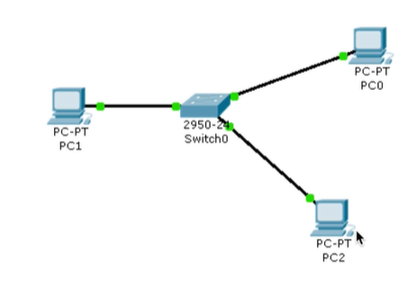
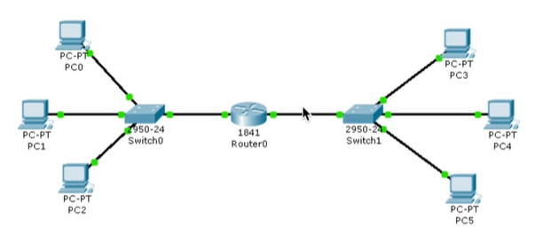
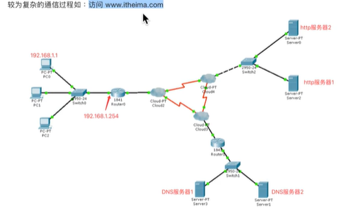
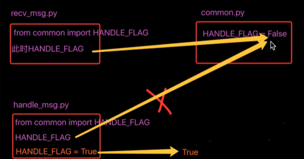
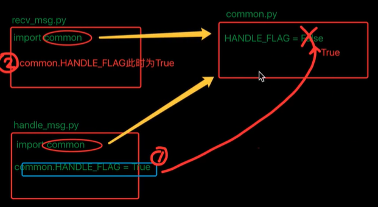
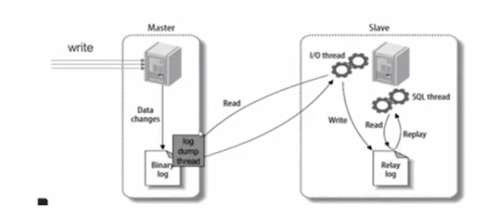
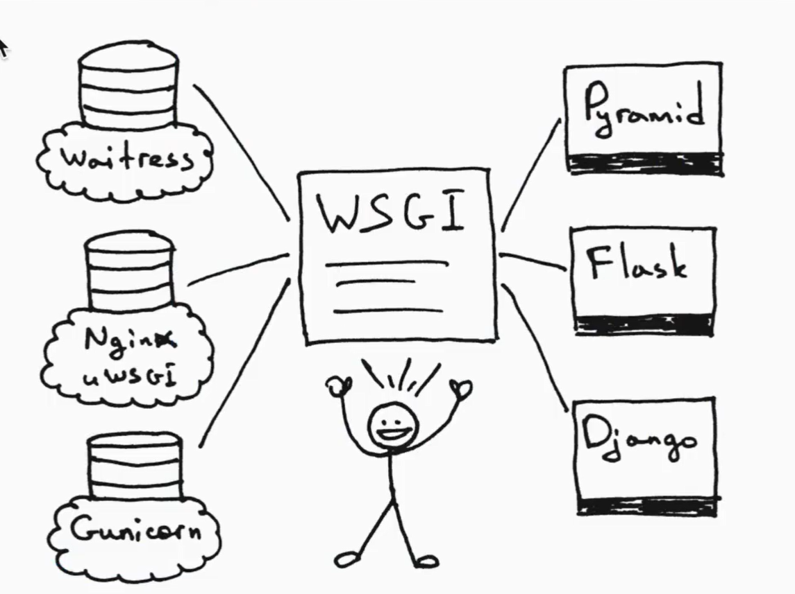
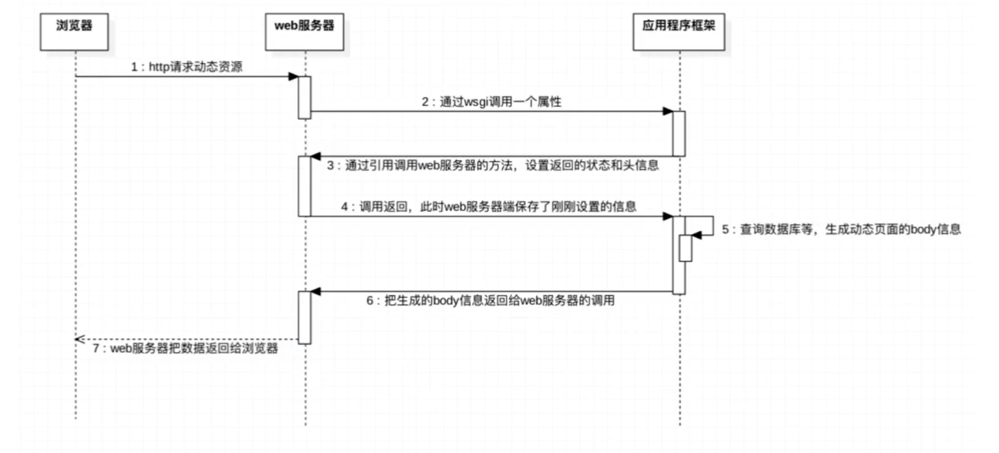

# tcp服务器

## 流程：

### ==目的==：完成一个tcp服务器的功能

1. socket创建一个套接字
2. bind绑定ip和port
3. listen使套接字变为可以被动链接
4. accept等待客户端的链接
5. recv/send接收发送数据

一个很简单的tcp服务器如下：

```python
import socket

#创建socket
#监听套接字：监听套接字负责等待有新的客户端进行连接
tcp_server_socket = socket.socket(socket.AR_INET,socket.SOCK_STREAM)

#本地信息
address = ('',7700)

#绑定
tcp_server_socket.bind(address)

#改为被动模式
tcp_server_socket.listen(128)

#等待客户端的链接
#accpet产生的新的套接字用来为客户端服务
new_client_socket,client_addr = tcp_server_socket.accept()

recv_data = new_client_socket.recv(1024)
print(recv_data.decode('gbk'))

new_client_socket.close()
tcp_server_socket.close()
```


# 多任务-线程

## 线程：

多线程执行：

```python
import time
import threading

def test1():
    for i in range(5):
        print('----test1----{0}---'.format(i))

def test2():
    for i in range(5):
        print('----test2----{0}---'.format(i))
def main():
    t1 = threading.Thread(target=test1)
    t2 = threading.Thread(target=test2)
    t1.start()
    time.sleep(1)
    t2.start()
    time.sleep(1)
    
    while True:
        length = len(threading.enumerate())
        print('当前运行的线程数为：{0}'.format(length))
        if length<=1:
            break
```


```python
import threading
import time

class MyThread(threading.Thread):
    def run(self):
        for i in range(5):
            time.sleep(1)
            smg = "I'm" + self.name +'@' + str(i)   #name 属性保存的是当前线程的名字
            print(msg)
            
if __name__ == '__main__':
    t = MyThread()
    t.start()    #start会调用类里的run方法
```


> 并行：真的多任务
>
> 并发：假的多任务

# 互斥锁

当多个线程几乎同时修改某一个共享数据的时候，需要进行同步机制。

保证了多个线程安全访问竞争资源，最简单的同步机制是引入互斥锁。

```python
#创建锁
mutex = threading.Lock()

#锁定
mutex.acquire()

#释放
mutex.release()
```


1.文件下载器升级

2.迭代器

3.range和xrange的区别，xrange的优点，P48 07:00

# http协议

## 是什么？

简单来说是一种协议，用来浏览服务器和浏览器传输的一种约定，请求和发送均基于tcp按照一定的格式去发送。


实例，百度：

浏览器----->服务器发送的请求格式如下：

```http
GET / HTTP/1.1
Host: www.baidu.com
Connection: keep-alive
Cache-Control: max-age=0
sec-ch-ua: "Chromium";v="88", "Google Chrome";v="88", ";Not A Brand";v="99"
sec-ch-ua-mobile: ?0
Upgrade-Insecure-Requests: 1
User-Agent: Mozilla/5.0 (Macintosh; Intel Mac OS X 11_1_0) AppleWebKit/537.36 (KHTML, like Gecko) Chrome/88.0.4324.146 Safari/537.36
Accept: text/html,application/xhtml+xml,application/xml;q=0.9,image/avif,image/webp,image/apng,*/*;q=0.8,application/signed-exchange;v=b3;q=0.9
Sec-Fetch-Site: none
Sec-Fetch-Mode: navigate
Sec-Fetch-User: ?1
Sec-Fetch-Dest: document
Accept-Encoding: gzip, deflate, br
Accept-Language: zh-CN,zh;q=0.9,ko;q=0.8,en;q=0.7
Cookie: BIDUPSID=07177F618C4545654BA5E2C2D04B5CA0; PSTM=1611678319; BAIDUID=07177F618C454565DD62D16D6F7AA04D:FG=1; BD_UPN=123253; __yjs_duid=1_88173f149020fb556265160208aa47391611714733679; BDORZ=B490B5EBF6F3CD402E515D22BCDA1598; BD_HOME=1; H_PS_PSSID=33425_33241_33344_33337_26350; BAIDUID_BFESS=07177F618C454565DD62D16D6F7AA04D:FG=1; BA_HECTOR=250gak2g85812ga0ct1g1qgk10q
```


服务器---->浏览器会送的请求格式如下：

```http
HTTP/1.1 200 OK
Bdpagetype: 1
Bdqid: 0xeb294f98000043a3
Cache-Control: private
Connection: keep-alive
Content-Encoding: gzip
Content-Type: text/html;charset=utf-8
Date: Fri, 05 Feb 2021 13:06:06 GMT
Expires: Fri, 05 Feb 2021 13:06:03 GMT
Server: BWS/1.1
Set-Cookie: BDSVRTM=0; path=/
Set-Cookie: BD_HOME=1; path=/
Set-Cookie: H_PS_PSSID=33425_33241_33344_33337_26350; path=/; domain=.baidu.com
Strict-Transport-Security: max-age=172800
Traceid: 1612530366035028250616945162587211842467
X-Ua-Compatible: IE=Edge,chrome=1
Transfer-Encoding: chunked
```

上述均称为header(头)

只要遇到第一个空行，下面开始均是body。


tcp3次握手，4次挥手 早上再看一次


Content-Length:%d. 告诉客户端body有多长，让客户端自行判断是有接收完毕

# Epoll


==创建==epl = select.epoll() 

Epl.register(tcp_server_socket.fileno(),select.EPOLLIN|select.EPOLLET)

第二个参数决定是在收到数据的时候通知（1）还是发送数据的时候通知（2）操作系统

Epl.poll()默认堵塞

直到os检测到数据到来，通过事件通知方式告诉这个程序，此时才会解堵塞，

返回列表[（套接字对应的文件描述符，这个文件描述符到底是什么事件 例如可以调用recv接收等）]

# 网络通信过程


IP:一个协议或一个地址

# IP掩码

决定IP的类型。（与IP按位与运算，得出网络型号）

## mac地址

设备网卡里的唯一id

## 集线器(hub)

缺点：收到的数据趣步都以广播形式发送，随着设备增多，线路越来越拥堵。

## 交换机



可广播可单播

### ==验证形式==

> IP和Mac地址都要相同才能正常通信
>
> 第一次请求Mac地址时，mac地址发送ff:ff:ff:ff:ff:ff（广播形式，均能接收）
>
> 所有接收到广播的设备验证是否需要返回自己的Mac地址，
>
> 判断后返回（单播形式）给邀请机Mac地址后可以正常单播通信。

### ==中间人攻击==

（arp攻击）

Pc2先在pc1发广播前主动给pc1回自己的mac地址（假扮成pc0的mac地址），同理告诉p0自己的mac地址，实现pc0和pc1在传递数据时被pc2实时监听，是最简单的arp攻击形式。

## 使用路由器链接多个网络




### 路由器

链接两个以上的网为一个大网，使设备能够在不在同一个网络下进行通信。（实现互联网）

至少有两个网卡。

### 网关

具有把收到的数据转发出去的能力的设备。

当一台电脑发送的目标IP地址与其所在的网络不在同一个网络的时候默认把数据转发给网关的这台设备。

通信方式：实例（192.168.1.1要给192.168.2.1发送数据（A类IP））

1. 目的IP写`192.168.2.1`，目的mac写路由器同网络部分的mac
2. 路由器和交换器的接口（一个mac地址）可以和该交换器的其他设备进行通信。
3. 路由器通过两个网卡互相通信，此时把目的mac地址转换成192.168.2.1的mac地址，源mac地址转换成路由器与192.168.2.1同一网络的接口的mac地址

==总结==

目标和源IP地址不变，目的和源mac地址会改变。

mac存在的意义：

ip只是逻辑上设备的地址（指标），在通信过程中两个设备的传递基于mac通信来完成（就像递东西时的左手和右手一样）。

## 浏览器访问服务器的过程（通信过程复杂）



DNS服务器：专门解析域名对应的IP地址。

步骤：

1. 输入解析域名（www.baidu.com），在DNS服务器解析域名对应的对方的IP地址。
    1. 向网关发送arp的到默认网关的mac地址
    2. 把数据发送给默认网关
    3. 根据IP判断是哪个地区的IP，在cloud分区
    4. 发送给DNS服务器解析
2. 向服务器发送tcp的三次握手
3. 给服务器发送tcp数据包（http协议），等待服务器的应答
4. 结束后四次挥手

# GIL（全局解释器锁）

**GIL面试题如下**

>描述python GIL的概念，以及它对python多线程的影响？编写一个多线程抓取网页的程序，并阐明多线程抓取程序是否可比单线程性能有提升，并解释原因。

cpython编辑器中有GIL，只能让单进程运行单任务

多线程先抢锁，保证同一时刻只有一个线程在做任务。

**参考答案**

>1. python语言和GIL没有关系。仅仅是由于历史原因在Cpython虚拟机（解释器），难以移出GIL。
>2. GIL：全局解释器锁。每个线程在执行的过程都需要先获取GIL，保证同一时刻只有一个线程可以执行代码。
>3. 线程释放GIL锁的情况：在IO操作等可能会引起阻塞的system call之前，可以暂时释放GIL,但在执行完毕后，必须重新获取GIL Python 3.X使用计时器（执行时间达到阀值后，当前新城释放GIL）或Python 2.x,tickets计数达到100
>4. 多线程爬取比单线程性能有提升，因为遇到IO阻塞会自动释放GIL锁

但是GIL会在合适的时期转换到其他的线程。

计算密集型：多进程

IO密集型：多线程，携程

# 深拷贝，浅拷贝

```python
a= [11, 22]
b= [33, 44]
c= [a, b]

#追随者,但不会拷贝元组（不可变）
d= copy.copy(c)
#镜子，也不会拷贝元组
e= copy.deepcopy(c)

id(c) != id(d) != id(e)

c.append([55, 66])

c = [[11,22],[33,44],[55,66]]

d = [[11,22],[33,44]]

e = [[11,22],[33,44]]
```

当被拷贝的数据均不可变（元组），浅拷贝和深拷贝均不会拷贝该数据，都是引用指向

当被拷贝的数据里有可变数据（元组内的列表），浅拷贝不会拷贝该数据，深拷贝依然会深拷贝

# 变量名的协议

xx:共有属性

_x:导入时无法使用

__x:私有属性，无法在外部直接访问

xx_：用于避免与 python关键词的冲突

# 导入模块方式

1. From xxx import yyy
2. import xxx
3. from xxx import *
4. Import xxx,zzz
5. import xxx as A(避免与变量名重名)

```python
import sys

#按该列表下的地址顺序查找模块文件
sys.path

#先确保搜索这个路径
sys.path.append('/home/~~')
sys.path.insert('/home/~~')

# 重新加载aa模块，import有防止多次导入机制，该方法可以更新模块
from imp import reload
reload(aa)
```



> 此时变量指向了False值，修该变量只是定义了一个局部变量名，要加global声明
>
> 但它指向别的值是因为该数据是不可变类型，若是可变类型（如列表），指向不会变，即可以直接改变模块里的变量




> 总结：模块间的公用变量导入时尽量用import，防止出错


# 封装，继承，多态

变量（属性）是独有的，函数公用一个（模版）。

函数的方法的区别：

self是一个形参，可以写成别的名称

多态：

调用同样的方法，若子类修改了父类的方法，分别用子类和父类调用该方法时，得到的结果不同，该现象叫多态。

# 多继承以及MRO顺序

多继承即有多个父类，

函数名就是一个变量名。

重载（如c++）:

```python
class Parent(object):
    def __init__(self,name):
        self.name = name
        
class Son1(Parent):
    def __init__(self,name,age):
        self.name = name
        self.age = age
        
#重载即在静态语言中（如c,c++）根据参数类型的不同选择不同的函数进行调用
#在python中变量名即可以看做为变量名，最后一次的定义覆盖了前一次的引用值，即几乎没有重载，叫重写
class Son2(parent):
    def set_info(int number):
        pass
    def set_info(char *str):
        pass
    
```


实例：

```python
#定义时星号表示类型
def test(a,b,*args,**kwargs):
#引用时星号表示拆包
```

父类和子类面试题

```python
class Parent(object):
    x = 1
    
class Child1(Parent):
    pass

class Child2(Parent):
    pass

print(Parent.x,Child1.x,Child2.x)
Child1.x = 2
print(Parent.x,Child1.x,Child2.x)
Parent.x = 3
print(Parent.x,Child1.x,Child2.x)
```

答案，以上代码的输出是：

```python
1 1 1
1 2 1
3 2 3
```

# 静态方法

既不被实例属性调用，也不被类属性调用，即不希望传参数。

>调用实例方法，默认传实例属性
>
>调用类方法，默认传类属性
>
>调用静态方法，默认什么也不传

# @property

功能体现：被调用时，不用写括号（参数只有实例属性），写必须返回一个值。

`相当于把方法改成了属性`可读性提高

总结：体现了封装性

property属性的两种方式：

1. 装饰器：@property
2. 类属性：在类中定义值为property对象的类属性

```python
class Goods(object):
    def __init__(self):
        #原价
        self.original_price = 100
        #折扣
        self.discount = 0.8

    @property
    def price(self):
        new_price = self.original_price*self.discount

    @price.setter
    def price(self,value):
        self.original_price = value

    @price.deleter
    def price(self):
        del self.original_price

#分别引用的方法
obj = Goods()
obj.price			#获取商品价格
obj.price = 100		#修改商品价格
del obj.price		#删除商品价格
```

```python
class Foo(object):
    def __init__(self):
        #原价
        self.original_price = 100
        #折扣
        self.discount = 0.8

    def get_bar(self):
        new_price = self.original_price*self.discount

    def set_bar(self,value):
        self.original_price = value

    def del_bar(self):
        del self.original_price

#分别引用的方法

    
BAR = property(get_bar，set_bar,del_bar,'description...')

obj = Foo()

obj.BAR
obj.BAR = 'alex' 		#自动调用第二个参数中定义的方法，并将'alex'当作参数传入
desc = Foo.BAR.__doc__	#自动获取第四个参数中设置的值：description
print(desc)
del obj.BAR
```

优点：能够简化调用者在获取数据的流程

旧版：定义一个私有属性，配合两个共有方法（getter和setter）

升级版：

```python
class Money(object):
    def __init__(self):
        self.__money = 0
        
    def getMoney(self):
        return self.__money
    
    def setMoney(self,value):
        if isinstance(value,int):
            self.__money = value 
    else:
        print('error')
        
    money = property(getMoney,setMoney)
    
a = Money()
a.money = 100		
print(a.money)
```

或者

```python
class Money(object):
    def __init__(self):
        self.__money = 0
    
    #使用装饰器对money进行装饰，那么会自动添加一个叫money的属性，当调用获取money的值时，调用装饰的方法
    @property  
  	def getMoney(self):
        return self.__money
    #使用装饰器对money进行装饰，当对money设置值时，调用装饰的方法 
	@money.setter
    def setMoney(self,value):
        if isinstance(value,int):
            self.__money = value 
        else:
        	print('error')
          
a = Money()
a.money = 100
print(a.money)
```

# 实现上下文管理器的方式

1. 

```python
class File():
    
    def __init__(self,filename,mode):
        self.filename = filename
        sele.mode = mode
        
    def __enter__(self):
        print('entering')
        self.f = open(self.filename,self.mode)
        return self.f
    
    def __exit__(self,*args):
        print('will exit')
        self.f.close()
        
with File('out.txt','w') as f:		#自动调用__enter__
    print('writing')
    f.write('hello python')			#自动调用__exit__
```


2. 

```python
#类似迭代器的方式
from contextlib import contextmanager

@contextmanager
def my_open(path, mode):
    f = open(path, mode)
    yield f
    f.close()
    
with my_open('out.txt','w') as f:
    f.write('hello,the simplest context manager')
```

# MySQL-基本使用

数据类型

使用原则：够用就行，尽量使用取值范围小的，而不用大的，可以节省存储空间

常用数据类型如下：

- 整数：int,bit

- 小数：decimal

- 字符串: varchar,char
- 日期时间：date,time,datetime
- 枚举类型（enum）

特殊说明的类型：

- varchar表示可变长度的字符串，char表示固定长度的字符串
- decimal表示浮点数，如decimal(5,2)表示共存5个数，小数占2位
- 字符串text表示存储大文本，当字符大于4000时推荐使用

| 类型        | 字节大小 |
| ----------- | -------- |
| TINYINT     | 1        |
| SMALLINT    | 2        |
| MEDIUNINT   | 3        |
| INT/INTEGER | 4        |
| BIGINT      | 5        |

外键：如果这一个表的一列数据是另一个表的主键，那么这一列数据称为外键。

## 1. 操作命令行(不分大小写)

### -- 命令行连接

```mysql
mysql -uroot -p(password)

#退出
exit/quit/ctrl+d
```

### -- 查看数据库列表

```mysql
show databases;

#查看创建的数据库
show create database 名字;

#退出情况
databases;
```

### -- 显示时间

```mysql
#显示时间
select now();
```

### -- 创建数据库

```mysql
create database 名字;
create database 名字 charset=utf8;
```

### -- 删除数据库

```mysql
drop database 名字;
```

### -- 查看当前使用的数据库

```mysql
select database();
```

## 2. 数据表的操作

### -- 查看当前数据库中所有表

```mysql
show tables;
show create table 数据表名字;  #查看创建数据表的命令行及信息
```

### -- 创建数据表

```mysql
create table 数据表名字 (字段 类型 约束[,字段 类型 约束])；
例如：
#primary key--主键 not null--非空 auto_increment--自增 unsigned--无符号写后面
create table xxxxx(id int primary key not null auto_increment,name varchar(30));

create table students(

id int unsigned not null auto_increment primary key,

name varchar(30),
#default 为默认值
age tinyint unsigned default 0,

high decimal(5,2),
#枚举中下表从1到4对应"男"到"保密",即可以用数字占位
gender enum("男","女","中性","保密") default "保密",

cls_id int unsigned

);
```

### -- 数据表的名字

```mysql
desc 数据表名字;
```

### -- 修改表结构

```mysql
#添加字段
alter table 名字 add 列名 类型；

#修改字段：重命名版
alter table 名字 change 原名 新名 类型及约束;

#修改字段：重命名版：不重命名版
alter table 名字 modify 列名 类型及约束;

#修改表-删除字段
alter table 表明 drop 列名;
```

### -- 删除表

```mysql
drop table 数据表名字;
```

### -- 显示表格信息

```mysql
show create table 名字;
```

## 3. 数据表里数据的增删改查(curd)

-----创建(create)，更新(update)，读取(retrieve)，删除(delete)。

### --增加

```mysql
#向数据表插入数据行
#主键字段可以用0,null,default来占位
insert into 名字 values( , , , ...);

#部分插入
insert into students(name,gender) value("小乔","女")

#多行插入
insert into students(name,gender)/null value(,)，(,),...;
```

### --修改

```mysql
update 数据表名字 set 列名= ;  #修改一整列
update 数据表名字 set 列名=xxx，列名2=xxx2,... where 行名=yyy;  #修改指定位置
```

### --删除

#### 物理删除

```mysql
delete from 数据表名字 where 条件;   #符合条件的全部删除，没有条件则删除整个数据表
```

#### 逻辑删除

```mysql
#用一个字段表示这条信息是否已经不能再使用了
alter table 数据表名字 ddd 列名 bit default 0;  #0b不删，1删
```

## 4. 查询

### -- 查询数据表中的数据

```mysql
select * from 名字 where name=xxx/id>n;  #信息量太大，where后面写约束条件
```

### --查询指定列

```mysql
select 列1，列2,... from 表名;
select 列1 as xxx，列2 as yyy,... from 表名;  #显示的时候把列名显示为as后面的代名词
select s.列1,s.列2,... from 数据表名 as s;
#从左到后按顺序列出
```

### --消除重复行

```mysql
select distinct 列名 from 数据表;
```

## 4-1. 条件查询

### --  比较运算符

```mysql
select ... from 表名 where ...;
#>/</>=/<=/=/!=
```

### -- 逻辑运算符

```mysql
and/or/not
```

## 4-2. 模糊查询

```mysql
-- like
-- %替换一个或者多个字符，可以没有
-- _替换一个字符
#查询name中以'小'开始的名字
select name from students where name like '小%';
#查询至少有两个字的名字
select name from students where name like '__%';
-- rlike
#周开头
select name from students where name rlike '^周.*'; 
#周开头伦结尾
select name from students where name rlike '^周.*伦$'
```

### 4-3. 范围查询

```mysql
select name,age from students where age  /not in (12,18,34);
#(age>12 and age<18) or (age>18 and age<34

select name,age from students where age /not between 18 and 34;
#age在 18~34
```

### -- 空判断

```mysql
#判断空
select * from students where height is (not) null;
```

### -- 排序

```mysql
select * from students where (age between 18 and 34) and gender=1 order by age asc/desc,id asc/desc,...;
#asc--从小到大排，desc--从大到小排
#第一个字段相同按第二个字段....以此类推
```

### -- 聚合函数

```mysql
#支持函数
#计算男性有多少人
#运行count()函数
select count(*) as 男性人数 from students where gender=1;

#找最大/小的age
select max/min(age) from students;
#找总和/平均age
select sum/avg(age) from students;
select sum(age)/count(*) from students;
#select 后也可以放表达式

#round(所得的结果,保留的位数)--四舍五入
select round(sum(age)/count(*),3) from students;
```

### -- 分组

```mysql
#group by
#按性别分组
select gender from students group by gender;
#计算每种性别的人数
select gender,count(*) from students group by gender;
#显示每个组里面的信息
select gender,group_concat(name,"_",age,"_",id) from students where ... group by gender;
#各性别平均年龄是否大于30  having是对结果进行判断 where 对数据表进行判断
select gender,group_concat(name) from students group by gender having avg(age)>30;
```

### -- 分页

```mysql
#只显示从start开始的前count个
select * from students where gender=1 limit start,count;
#limit要放在条件的最后
```

### -- 链接查询

```mysql
-- select ... from 表A inner join 表B;
-- 查询 有能够对应班级的学生以及班级信息
-- 把两个表合并成一个显示
select * from students inner join classes on students.cls_id=classea.id;

-- 按要求显示姓名和班级
select students.*,classes.name from students inner join classes on students.cls_id=classes.id;
-- 左链接,以左边为基准一一搜索右边的表
select * from students left join classes on students.cls_id=classes.id;

-- 查询没有对应班级信息的学生
select * from students left join classes on students.cls_id=classes.id having/where c.id is null;
```

### -- 自关联

```mysql
#创建areas表
create table areas(aid int primary key,atitle varchar(30),pid int);
```

source 文件名;   --把某个文件导入

```mysql
#一张表子关联查询
select province.atitle,city.atitle from areas as province inner join areas as city on city.pid=province.aid having province.atitle='吉林省';
```

### -- 子查询

```mysql
#查询最高个男生的信息
select * from students where high=(select max(high) from students);
```

## -- 将分组结果写入到另一个数据表

```mysql
#不需要写value
insert into good_cates(name) select cate_name from goods group by cate_name;
```

### -- 设置一个外键

```mysql
-- 给brand_id 添加外键约束成功
alter table goods add foreign key (brand_id) references good_brands(id);
-- 给cate_id 添加外键失败
-- 会出现1452错误
-- 错误原因：已经添加了一个不存在的cate_id值12，因此需要先删除
alter table goods add foreign key (cate_id) references good_cates(id):
```

-- 取消外键

```mysql
#goods_ibfk_1在 show create table xxx里找;
-- 1.
alter table goods drop foreign key goods_ibfk_1;
-- 2.
alter table goods drop foreign key 外键名称;
```

> 尽量少用外键，效率低

# Python操作MySQL步骤

## -- 查

```python
from pymysql import *
#创建Connection连接
conn = connect(host='localhost',port=3306,user='root',password='43265225941',database='jing_dong',charset='utf8')
#创建Cursor对象（游标）
cs1=conn.cursor()
#返回执行行数
#相当与缓存
cs1.execute('select * from goods;')
cs1.execute()
```

-- cursor(游标)命令

```python
fetchone  #按游标位置返回一个元组，是数据表中的一行数据
fetchmany(n) #按游标位置返回元组，元素也是元组，是数据表中的n行数据
fetchall(n)  #把游标以后的所有数据以元组形式输出
1.查所有信息
2.查所有的分类
3.查所有的品牌分类
```

## -- 增

```python
cs1.execute()
#提交,类似于GitHub推送仓库内容，但提交链接，而不是游标cursor
conn.commit()
#在commit之前撤回仓库
conn.rollback()
```

-- 防止sql注入

```python
param = [find_name]
#execute语句里%s和param列表元素数要一致
count = cs1.execute('select * from goods where names=%s',param)
```

==作业：==

额外创建三张新的表

首先让用户登录，否则让用户注册，之后引导用户去买东西（先浏览），后下订单

注册，登陆，下订单

## -- 视图

视图的作用：

1. 提高重用性，就像一个函数
2. 对数据库重构，却不影响程序的运行
3. 提高了安全性能，可以对不同的用户
4. 让数据更加清晰

```mysql
#一张虚拟的表（不是真的表），会随着原数据表的改动而更新
create view v_goods_info as ......(sql语句)
```

## -- 事务

所谓事务，他是一个操作序列，这些操作要么都执行，要么都不执行，它是一个不可分割的工作单位。

### 事故四大特性（简称ACID）

- 原子性(Atomicity)
- 一致性(Consistency)
- 隔离性(Isolation)
- 持久性(Durability)

mysql默认不开事务，用start transaction/begin;开启事务

commit;提交

rollback;撤回

用到了锁的思想

## -- 索引

是一种特殊的文件，它们包含着对数据表里所有记录的引用指针。

通俗地讲，数据库索引好比一本书前的目录，能加快数据库的查询速度。


-- 建立索引

```mysql
#创建叫title_index的索引
create index title_index on test_index(title(10));
```

## -- 账户管理

### -- 查看所有用户

```mysql
select host,user,authenticaton_string from user;
```

```mysql
创建用户&授权
grant 权限列表 on 数据库 to '用户名'@'访问主机' identified by 密码;

grant select on jing_dong.* to 'laowang'@'localhost' identified by '123456';
grant all privileges on jing_dong.* to 'moon'@'%' identified by '225941';
```

## -- mysql主从

```mysql
#备份
mysqldump -uroot -p 数据库名 > python.sql;
#恢复
mysql -uroot -p 新数据库名 < python.sql;
```

## 配置主从同步的方法（了解）

### 1. 主从同步的定义

主从同步使得数据可以从一个数据库服务器复制到其他服务器上，在复制数据时，一个服务器充当主服务器（master），其余的服务器充当从服务器（slave）。因为复制是异步进行的，所以从服务器不需要一直连接着主服务器，从服务器甚至可以通过拨号断断续续地连接主服务器。通过配置文件，可以指定复制所有的数据库，某个数据库，甚至是某个数据库上的某个表。

使用主从同步的好处：

- 通过增加从服务器来提高数据库的性能，在主服务器上执行写入和更新，在从服务器上向外提供读功能，可以动态地调整从服务器的数量，从而调整整个数据库的性能。
- 提高数据安全，因为数据已复制到从服务器，从服务器可以终止复制进程，所以，可以在从服务器上备份而不破坏主服务器相应数据
- 在主服务器上生成实时数据，而在从服务器上分析这些数据，从而提高主服务器的性能

### 2. 主从同步的机制



Mysql服务器之间的主从同步是基于二进制日志机制，主服务器使用二进制日志来记录数据库的变动情况，从服务器通过读取和执行该日志文件来保持和主服务器的数据一致。

在使用二进制日志时，主服务器的所有操作都会被记录下来，然后从服务器会接收到该日志的一个副本。从服务器可以指定执行该日志中的哪一类事件（譬如只插入数据或者只更新数据），默认会执行日志中的所有语句。

每一个从服务器会记录关于二进制日志的信息：文件名和已经处理过的语句，这样意味着不同的从服务器可以分别执行同一个二进制日志的不同部分，并且从服务器可以随时连接或者中断和服务器的连接。

主服务器和每一个从服务器都必须配置一个唯一的ID号（在my.cnf文件的[mysqld]模块下有一个server-id配置项），另外，每一个从服务器还需要通过CHANGE MASTER TO语句来配置它要连接的主服务器的ip地址，日志文件名称和该日志里面的位置（这些信息存储在主服务器的数据库里）

### 3. 配置主从同步的基本步骤

有很多种配置主从同步的方法，可以总结为如下的步骤：

1. 在主服务器上，必须开启二进制日志机制和配置一个独立的ID
2. 在每一个从服务器上，配置一个唯一的ID，创建一个用来专门复制主服务器数据的账号
3. 在开始复制进程前，在主服务器上记录二进制文件的位置信息
4. 如果在开始复制之前，数据库中已经有数据，就必须先创建一个数据快照（可以使用mysqldump导出数据库，或者直接复制数据文件）
5. 配置从服务器要连接的主服务器的IP地址和登陆授权，二进制日志文件名和位置

### 4. 详细配置主从同步的方法

主和从的身份可以自己指定，我们将虚拟机Ubuntu中MySQL作为主服务器，将Windows中的MySQL作为从服务器。 在主从设置前，要保证Ubuntu与Windows间的网络连通。

#### 4.1 备份主服务器原有数据到从服务器

如果在设置主从同步前，主服务器上已有大量数据，可以使用mysqldump进行数据备份并还原到从服务器以实现数据的复制。

#### 4.1.1 在主服务器Ubuntu上进行备份，执行命令：

```
mysqldump -uroot -pmysql --all-databases --lock-all-tables > ~/master_db.sql
```

说明

- -u ：用户名
- -p ：示密码
- --all-databases ：导出所有数据库
- --lock-all-tables ：执行操作时锁住所有表，防止操作时有数据修改
- ~/master_db.sql :导出的备份数据（sql文件）位置，可自己指定

#### 4.1.2 在从服务器Windows上进行数据还原

找到Windows上mysql命令的位置


新打开的命令窗口，在这个窗口中可以执行类似在Ubuntu终端中执行的mysql命令


将从主服务器Ubuntu中导出的文件复制到从服务器Windows中，可以将其放在上面mysql命令所在的文件夹中，方便还原使用


在刚打开的命令黑窗口中执行还原操作:

```
mysql –uroot –pmysql < master_db.sql
```


#### 4.2 配置主服务器master（Ubuntu中的MySQL）

#### 4.2.1 编辑设置mysqld的配置文件，设置log_bin和server-id

```
sudo vim /etc/mysql/mysql.conf.d/mysqld.cnf
```

 

#### 4.2.2 重启mysql服务

```
sudo service mysql restart
```


#### 4.2.3 登入主服务器Ubuntu中的mysql，创建用于从服务器同步数据使用的帐号

```
mysql –uroot –pmysql
GRANT REPLICATION SLAVE ON *.* TO 'slave'@'%' identified by 'slave';
FLUSH PRIVILEGES;
```


#### 4.2.4 获取主服务器的二进制日志信息

```
SHOW MASTER STATUS;
```


File为使用的日志文件名字，Position为使用的文件位置，这两个参数须记下，配置从服务器时会用到

#### 4.3 配置从服务器slave（Windows中的MySQL）

#### 4.3.1 找到Windows中MySQL的配置文件


#### 4.3.2 编辑my.ini文件，将server-id修改为2，并保存退出。


#### 4.3.3 打开windows服务管理

可以在开始菜单中输入services.msc找到并运行


#### 4.3.4 在打开的服务管理中找到MySQL57，并重启该服务


### 5. 进入windows的mysql，设置连接到master主服务器

```
change master to master_host='10.211.55.5', master_user='slave', master_password='slave',master_log_file='mysql-bin.000006', master_log_pos=590;
```

注：

- master_host：主服务器Ubuntu的ip地址
- master_log_file: 前面查询到的主服务器日志文件名
- master_log_pos: 前面查询到的主服务器日志文件位置


### 6. 开启同步，查看同步状态


### 7. 测试主从同步

在Ubuntu的MySQL中（主服务器）创建一个数据库  在Windows的MySQL中（从服务器）查看新建的数据库是否存在 

4.1 备份住服务器原有的数据到从服务器

# 服务器

静态请求由服务器自行完成（路径越短越好），动态请求由web框架执行。

nginx/apache

### WSGI协议

让服务器调用python文件





1. 服务器默认调用python文件里的application函数，且必须有两个参数(字典，函数的引用)是2中函数的引用，要调用返回时指向的函数，在调用时，把header传过去，在return时把body传过去
2. 传到服务器里的一个函数
3. 最有把header和body合一起
4. 再把响应返回给服务器

# 闭包

全局变量修改变量的方向用global

闭包和函数的区别在于函数只能传递代码，而闭包可以传递固定的数据（在外围包装的函数）和代码

__call__(对象后面加括号，触发执行)

```python
class Foo:
    def __init__(self):
        pass
    def __call__(self,*args,**kwargs):
        print('__call__')
obj = Foo()  #执行init
obj()  #执行call     
```

```python
def line_6(k,b):
    def create_y(x):
        print(k*x+b)
    return create_y. #返回值是一个指向函数的指针

line6_1 = line_6(1,2)
line6_1(0)
line6_1(1)
line6_1(2)
```

# 装饰器（重要）

写代码遵循`开放封闭`原则，虽然在这个原则是用的面向对象开发，但是也适用于函数式编程，简单来说，它规定已经实现的功能代码`不允许被修改`，但可以被扩展，即：

封闭：已实现的功能代码块

开放：对扩展开发

## 装饰器功能：

```python
import time
#call_func是传参时的中转站
def set_func(func):
    #这里的*作用为告诉解释器身份（元组，存储多个，字典，存储多个关键字变量）
	def call_func(num,*args,**kwargs):
		start_time = time.time()
		print('--------这是权限验证1---------')
		print('--------这是权限验证2---------')
		#这里*为拆包的意思
        func(num,*args,**kwargs)
		stop_time = time.time()
		print('alltime is %f'% (stop_time - start_time))
	return call_func

@set_func #等价于 test1 = set_func(test1)
def test1(num,*args,**kwargs):
	print('--------test1--------%d'%num)
	print('--------test1--------',args)
	print('--------test1--------',kwargs)
	for i in range(1000):
		pass

#test1 = set_func(test1)

#此时test1已添加装饰器功能
test1(100)
test1(100,200)
test1(100,200,300,mm=100)
```

# log日志

1. 输出到终端

```python
import logging

logging.basicConfig(level=logging.INFO,format='%(asctime)% - %(filename)s[line:%(lineno)d]-%(levelname)s:
logging.debug('sfadfs')
```

2. 保存到文件(常用)

```python
import logging

logging.basicConfig(level=logging.INFO,
                    file_name='./log.txt',
                    filemode='w',
                    format='%(asctime)s - %(filename)s[line:%(lineno)d]-%(levelname)s:
logging.debug('sfadfs')
```

3. 既可以输出到终端，也可以输出到文件

```python
import logging

#第一步，创建一个handlaer,用于写入日志文件
logger = logging.getLogger()
logger.setLevel(llgging.INFO)  #log等级开关

#第二步，创建一个handler,用于写入日志文件
logfile = 'log.txt'
fh = logging.FileHandler(logfile,mode='a')  #open的打开模式这里可以进行参考
fh.setLevel(logging.DEBUG)  #输出到file的log等级的开关

#第三步，再创建一个handler,用于输出到控制台
ch = logging.StreamHandler()
ch.setLevel(logging.WARNING)   #输出到console的log等级的开关

#第四步，定义handler的输出格式
formatter = logging.Formatter('%(asctime)s - %(filename)s[line:%(lineno)d]-%(levelname)s:)
fh.setFormatter(formatter)
ch.setFormatter(foematter)

#第五步:jianglogger添加到handler里面
logger.addHandler(fh)                             
logger.addHandler(ch)                              
                              
#日志
logger.debug/...('这是 logger debug message')                              
```

实现功能：

1. 支持路由功能（增删改查）
2. 数据库
3. log日志
4. wsgi
5. 复习单历


# 元类

类用来创建实例对象，元类用来创建类。

type = ('类名',(父类),{类属性字典})

class Foo(object,metaclass=....):

metaclass指定创建类的元类，默认为type

# 元类实现ORM

ORM是python变成语言后端web框架Django的核心思想，"Object Relational Mapping",即对象=关系映射，简称ORM。

